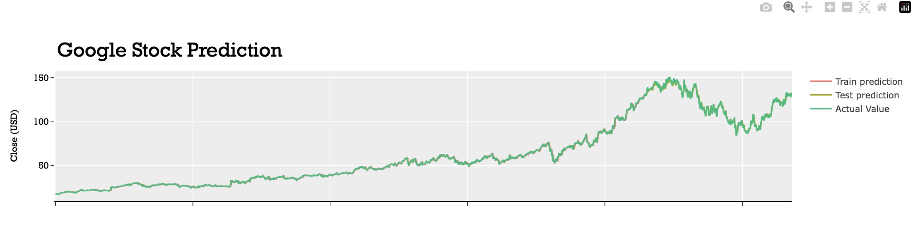

# DeepStockForecast

[](https://github.com/GuglielmoCerri/DeepStockForecast)
[](https://www.python.org/)



## Introduction

This repository contains a Python project for analyzing and forecasting stock prices using time series analysis and a GRU (Gated Recurrent Unit) neural network model. The project focuses on three major tech companies: **Google (GOOG), Apple (AAPL), and Microsoft (MSFT)**.

The analysis includes: data visualization, correlation analysis, trend and seasonality decomposition, and time series forecasting.

## Table of Contents

- [Requirements](#requirements)
- [Dataset](#dataset)
- [Analysis](#analysis)
- [Time Series Forecasting](#time-series-forecasting)
- [Results](#results)

## Requirements

To run the code in this repository, you can install all the necessary packages via:

```bash
> pip install -r requirements
```

## Dataset

The dataset used in this project includes historical stock price data for Google (GOOG), Apple (AAPL), and Microsoft (MSFT). The data is collected from [Yahoo Finance](https://finance.yahoo.com/) and covers the last 10 years.

## Analysis

The analysis step of the project includes several stages:

1. Checking for missing values (NAs) in the dataset.
2. Exploring the correlation between closing and opening prices for each company.
3. Visualizing stock attributes using line plots.
4. Decomposing trends and seasonality in stock prices.

## Time Series Forecasting

Time series forecasting is performed using a GRU (Gated Recurrent Unit) model. The GRU model is defined in the code, with specifications for input dimensions, hidden dimensions, number of layers, output dimensions, and other hyperparameters.

## Results

The results of the analysis and forecasting are visualized using various plots and graphs. The time series predictions are compared to the actual stock prices to evaluate the accuracy of the model's predictions. The performance of the model is also assessed using root mean squared error (RMSE) on both the training and testing sets.

## Conclusion

You can use this README as a starting point for your GitHub repository for the stock price analysis and forecasting project.